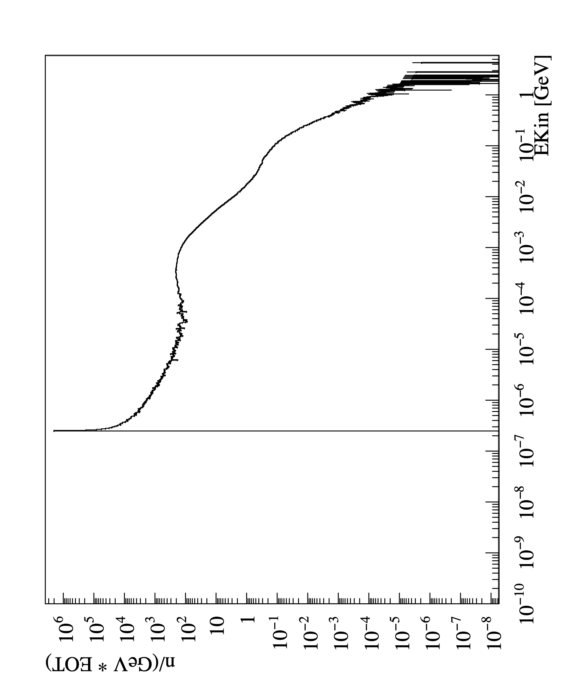
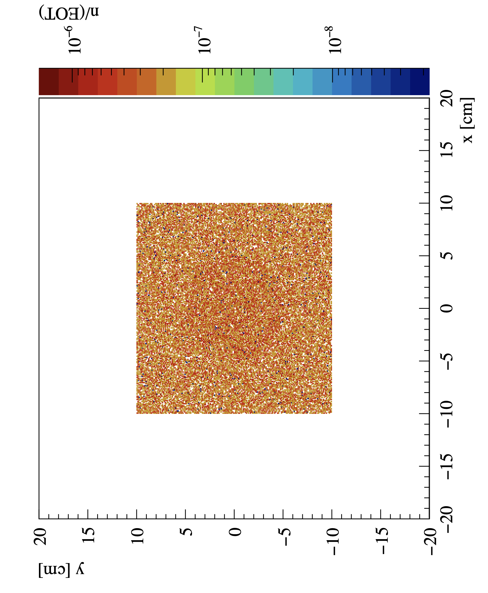
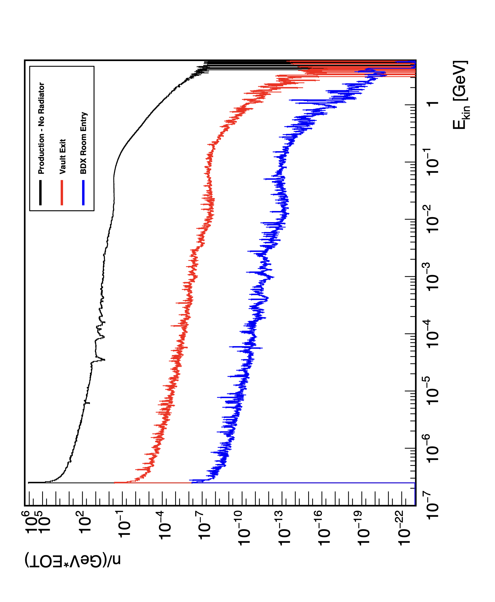

# BDX Analysis System

## Overview

This is an analsysis Python-based framework for analyzing particle physics simulation data from ROOT files produced by FLUKA simulation using [FlukaROOTOutput](https://github.com/AntoninoFulci/FlukaROOTOutput).

For example, we have the following typical analysis outputs:

<div align="center">
  
  
</div>

<div align="center">
  
</div>


### Key Features
- **Configuration-driven analysis** via YAML/JSON files
- **Multi-particle support** with flexible filtering
- **Energy histogram generation** with linear and logarithmic binning
- **Spatial analysis** for surface and volume intersections
- **New variable creation** for derived quantities
- **Histogram comparison** and overlay plotting
- **PDF export utilities** for results visualization
- **Parallel processing** via ROOT's RDataFrame

### Project Structure
```
BDX-FLUKA-Analysis/
├── run_analysis.py               # Main entry point
├── src/                          # Core library modules
│   ├── __init__.py               # Package initialization
│   ├── core.py                   # Main analysis engine
│   ├── config.py                 # Configuration data classes
│   ├── utils.py                  # Utility functions
│   ├── histogram.py              # Histogram data structures
│   ├── simulation_summary.py     # Summary data processing
│   ├── export_histograms.py      # PDF export functionality
│   └── comparison.py             # Histogram comparison tools
├── configs/                      # Configuration files
│   └── examples/                 # Example configurations
└── README.md                     # This file
```

---

## Getting Started

### Prerequisites
- Python 3.7+
- ROOT 6.22+ with PyROOT
- Required Python packages: `pint`, `numpy`, `pyyaml`, `pandas` (optional), `tabulate` (optional)

### Quick Start

1. **Basic Analysis Run:**
```bash
./run_analysis.py configs/particles/neutrons.yaml
```

2. **With Custom Input Directory:**
```bash
./run_analysis.py -i ../SimulationData --output-dir Results configs/particles/neutrons.yaml
```

The PDF export creates an organized `plots/` directory with descriptive filenames, for example by using [01_particle_analysis](configs/examples/01_particle_analysis.yaml):
- `01_1000bins_0.1eV_6.0GeV_neutrons_h1_enclose_lin.pdf` - Linear energy histogram (1st energy range)
- `01_1000bins_0.1eV_6.0GeV_neutrons_h1_enclose_log.pdf` - Logarithmic energy histogram (1st energy range)  
- `01_1000bins_0.1eV_6.0GeV_neutrons_h2_enclose.pdf` - 2D spatial histogram (1st energy range)
- `02_100bins_0.1eV_100.0eV_neutrons_h1_enclose_lin.pdf` - Linear energy histogram (2nd energy range)
- ... and so on for all energy ranges

The filename format is: `{order}_{binning}_{min_energy}_{max_energy}_{histogram_name}.pdf`

### Command Line Options
- `-i, --input-dir`: Override input directory for ROOT files
- `--output-dir`: Override output directory for results
- `--save-pdf`: Generate PDF files for all histograms after analysis

---

## System Architecture

### Data Flow
```
ROOT Files → RDataFrame → Filters → Histograms → Output Files
     ↓           ↓          ↓          ↓           ↓
Configuration → Variables → Particles → Analysis → Results
```

### Core Processing Pipeline
1. **Configuration Loading**: Parse YAML/JSON configuration files
2. **Data Initialization**: Create RDataFrame from ROOT file pattern
3. **Variable Creation**: Define new computed variables if specified
4. **Particle Filtering**: Apply particle type and energy filters
5. **Surface/Volume Analysis**: Process spatial intersection data
6. **Histogram Generation**: Create 1D energy and 2D spatial histograms
7. **Output Writing**: Save histograms to ROOT files
8. **Comparison Processing**: Generate overlay plots if configured

---

## Configuration Guide

### Configuration File Structure

All analysis parameters are defined in YAML or JSON configuration files. Here's the complete structure:

```yaml
# Input data configuration
input_directory: "/path/to/simulation/data"

# Particle definition
particle:
  particle_id: 8                    # Or [8, 13] for multiple particles
  name: "neutrons"                  # Used in output filenames
  variable: "EKin"                  # Energy variable to analyze
  weight: "Weight1"                 # Statistical weight variable

# Define new computed variables
new_variable:
  name: "EKin"                      # Variable name
  expression: "ETot - 0.939565378"  # ROOT expression

# Alternative: multiple new variables
new_variables:
  - name: "Beta"
    expression: "P / ETot"
  - name: "Gamma"
    expression: "ETot / 0.939565378"

# Output configuration
output:
  base_name: "analysis"
  directory: "./output"
  include_timestamp: false
  format_template: '{base_name}_{particle_name}_{n_bins}bins_{min_energy}_{max_energy}.root'

# Histogram configurations
histograms:
  - n_bins: 1000
    min_energy: 1.0e-10
    max_energy: 6.0
    also_log_bins: true
  - n_bins: 100
    min_energy: 0.001
    max_energy: 0.1
    also_log_bins: false

# Surface intersection analysis
surfaces:
  - id: 1000
    name: "enclose"
    xl: -250
    xh: 250
    yl: -250
    yh: 250
    bin_width: 0.5
    spatial_analysis: true

# 3D volume analysis
box_surfaces:
  - name: "detector"
    surface_id: 101
    xmin: -51.0
    xmax: 51.0
    ymin: -51.0
    ymax: 51.0
    zmin: 7468.0
    zmax: 7761.2
    bin_width: 0.5

# Histogram comparison
comparisons:
  - files:
      - "output1.root"
      - "output2.root"
    hists:
      - "neutrons_h1_enclose_lin"
      - "neutrons_h1_enclose_lin"
    labels:
      - "Configuration A"
      - "Configuration B"
    output: "comparison_plot"
    title: "Energy Comparison"
    x_label: "Energy [GeV]"
    y_label: "Rate [Hz]"
    logx: true
    logy: true
```

### Particle Configuration
NB: use the particle ID as specified in the FLUKA manual [Particle Codes].(https://flukafiles.web.cern.ch/manual/chapters/particle_and_material_codes/particles_codes.html)
#### Single Particle Type
```yaml
particle:
  particle_id: 8        # Neutron
  name: "neutrons"
  variable: "EKin"
  weight: "Weight1"
```

#### Multiple Particle Types
```yaml
particle:
  particle_id: [11, -11]  # Electrons and positrons
  name: "electrons"
  variable: "P"
  weight: "Weight1"
```

#### Common Particle IDs
- `8`: Neutron
- `3`: Electron
- `4`: Positron
- `10`: Mu+
- `11`: Mu-
- `7`: Photon

### Energy Range Configuration
All energies are in GeV.
#### Linear Binning
```yaml
histograms:
  - n_bins: 100
    min_energy: 0.001      # 1 MeV
    max_energy: 1.0        # 1 GeV
    also_log_bins: false
```

#### Logarithmic Binning
```yaml
histograms:
  - n_bins: 1000
    min_energy: 1.0e-10    # 0.1 eV
    max_energy: 6.0        # 6 GeV
    also_log_bins: true
```

### Surface Analysis Configuration

#### Standard Surfaces
```yaml
surfaces:
  - id: 1000              # Surface ID from simulation
    name: "exit_window"
    xl: -100              # X range for spatial histogram
    xh: 100
    yl: -100              # Y range for spatial histogram
    yh: 100
    bin_width: 1.0        # Spatial bin size in cm
    spatial_analysis: true # Enable 2D spatial histograms
```

#### Box Volume Analysis
```yaml
box_surfaces:
  - name: "detector_volume"
    surface_id: 101
    xmin: -50.0
    xmax: 50.0
    ymin: -50.0
    ymax: 50.0
    zmin: 7400.0
    zmax: 7800.0
    bin_width: 2.0
```

---

## Usage Examples

### Basic Neutron Analysis

```yaml
# configs/particles/neutrons_basic.yaml
input_directory: "/path/to/simulation"
particle:
  particle_id: 8
  name: "neutrons"
  variable: "EKin"
  weight: "Weight1"

new_variable:
  name: "EKin"
  expression: "ETot - 0.939565378"

histograms:
  - n_bins: 1000
    min_energy: 1.0e-10
    max_energy: 6.0
    also_log_bins: true

surfaces:
  - id: 1000
    name: "detector"
    spatial_analysis: true

output:
  directory: "./results"
```

**Run the analysis:**
```bash
./run_analysis.py configs/particles/neutrons_basic.yaml
```

### Multi-Energy Range Analysis

```yaml
# Detailed energy spectrum analysis
histograms:
  # Thermal neutron range
  - n_bins: 100
    min_energy: 1.0e-10  # 0.1 eV
    max_energy: 1.0e-7   # 100 eV
    also_log_bins: false
  
  # Epithermal range
  - n_bins: 100
    min_energy: 1.0e-7   # 100 eV
    max_energy: 0.0001   # 100 keV
    also_log_bins: false
  
  # Fast neutron range
  - n_bins: 100
    min_energy: 0.001    # 1 MeV
    max_energy: 6.0      # 6 GeV
    also_log_bins: false
```

### Spatial Analysis Configuration

```yaml
# Multiple detector surfaces
surfaces:
  - id: 1
    name: "entrance_window"
    xl: -200
    xh: 200
    yl: -200
    yh: 200
    bin_width: 2.0
  
  - id: 2
    name: "detector_face"
    xl: -100
    xh: 100
    yl: -100
    yh: 100
    bin_width: 1.0

# 3D detector volume
box_surfaces:
  - name: "main_detector"
    surface_id: 101
    xmin: -51.0
    xmax: 51.0
    ymin: -51.0
    ymax: 51.0
    zmin: 7468.0
    zmax: 7761.2
    bin_width: 1.0
```

### Comparison Analysis

```yaml
# Compare different configurations
comparisons:
  - files:
      - "results/config_a.root"
      - "results/config_b.root"
    hists:
      - "neutrons_h1_detector_lin"
      - "neutrons_h1_detector_lin"
    labels:
      - "Configuration A"
      - "Configuration B"
    output: "config_comparison"
    title: "Configuration Comparison"
    x_label: "Kinetic Energy [GeV]"
    y_label: "Rate [1/(GeV·EOT)]"
    logx: true
    logy: true
    x_min: 1.0e-8
    x_max: 6.0
```
---

## Advanced Features

### 1. Custom Energy Variables

The system supports creating derived energy variables using ROOT's expression syntax:

```yaml
new_variable:
  name: "EKin"
  expression: "ETot - 0.939565378"  # Kinetic energy for neutrons
```

### 2. Multi-Particle Analysis

Analyze multiple particle types simultaneously:

```yaml
particle:
  particle_id: [10, 11, 3, 4]  # Electrons, positrons, muons, anti-muons
  name: "leptons"
  variable: "P"
  weight: "Weight1"
```

### 3. Statistical Weighting

All histograms support statistical weights for proper normalization:

```yaml
particle:
  weight: "Weight1"  # Use simulation weights
```

Common weight variables:
- `Weight1`: Primary weight
- `Weight2`: Secondary weight
- `1.0`: Uniform weighting (no weights)

### 4. Flexible Output Naming

Customize output file naming with template strings:

```yaml
output:
  format_template: '{base_name}_{particle_name}_{n_bins}bins_{min_energy}_{max_energy}.root'
  include_timestamp: true  # Add timestamp to filename
```

### 5. Histogram Comparison

Generate overlay plots comparing multiple analyses:

```yaml
comparisons:
  - files: ["file1.root", "file2.root"]
    hists: ["hist_name", "hist_name"]
    labels: ["Label 1", "Label 2"]
    output: "comparison_plot"
    # Axis range control
    x_min: 1.0e-6
    x_max: 1.0
    y_min: 1.0e-10
    y_max: 1.0e-2
```
---

*Last updated: January 2026*
